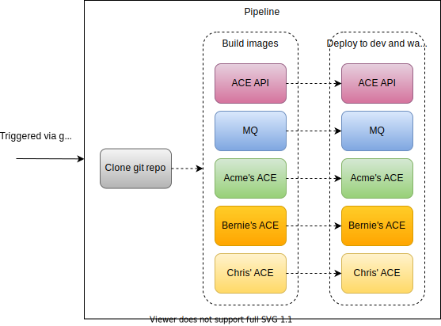
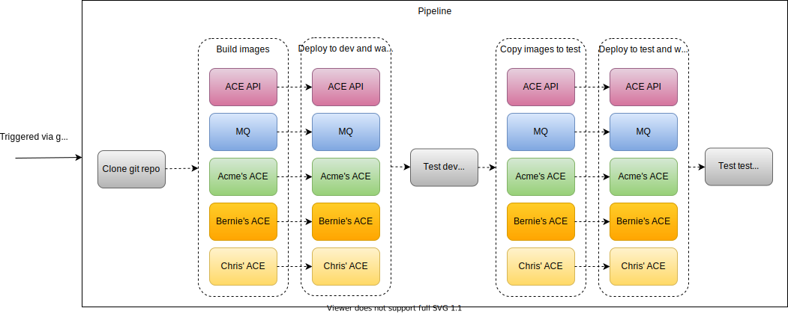

# Overview
This dir is for a demo name "Driveway Dent Deletion". The initial version of this
demo uses a Tekton pipeline to build images and deploy them for 4 App Connect
Integration Servers and 1 MQ server. Future versions of this demo will build
upon this.

# Prerequisites
A [script](prereqs.sh) is provided to setup the prerequisits for this demo
and this script is automatically run as part of the 1-click demo preparation.
The script sets up the following:
- Installs Tekton Pipelines v0.12.1
- Installs Tekton Triggers v0.5.0
- Creates a project to be used for the demo (default `cp4i`).
- Creates secrets to allow the pipeline to push images to the above project (default `cp4i`).
- Creates a secret to allow the pipeline to pull from the entitled registry
- Creates a `quotes` table in the Postgres sampledb database

# User steps
These steps will need to be documented in the demo docs:
- Fork/clone the repo
- Apply yaml to create the pipeline, configured to use the forked repo. Set
`FORKED_REPO` to the URL for your repo and change the `<NAMESPACE>` to the namespace of 1-click install in which you want the pipeline to run.
  ```
  export NAMESPACE=<NAMESPACE>
  oc project $NAMESPACE
  export BRANCH=master
  export FORKED_REPO=https://github.com/IBM/cp4i-deployment-samples.git
  cat cicd-webhook-triggers.yaml | \
    sed "s#{{FORKED_REPO}}#$FORKED_REPO#g;" | \
    sed "s#{{BRANCH}}#$BRANCH#g;" | \
    sed "s#{{NAMESPACE}}#$NAMESPACE#g;" | \
    oc apply -f -
  ```
- Run the following command to get the URL for the trigger:
  ```
  echo "$(oc  get route el-main-trigger --template='http://{{.spec.host}}')"
  ```
- Add the trigger URL to the repo as a webhook with the `Content type` as `application/json`, which triggers an initial run of the pipeline.

# Pipelines
## Initial pipeline for just the dev environment

## Pipeline with added support for dev/test environments

## Description of pipeline
- Trigger: Whenever a commit is made to the forked repo it triggers the
  pipeline.
- Build images tasks: Each of these tasks builds an image and pushes it to the cluster's local OpenShift Image Registry. The latest dockerfile and related files (bar files) are pulled from the forked git repo.
- Deploy to dev/test and wait for rollout tasks: Each of these tasks applies a CR to deploy/update an MQ/ACE microservice and waits for the deploy/update to rollout so the microservice is running the newly built image once the task has completed.
- Test ACE API task: Runs a test of the POST/GET endpoints to verify that the dev environment is working. This acts as a gate for rolling out the change to the test environment.
- Copy images to test tasks: Copies the images from the dev project to the test project.
